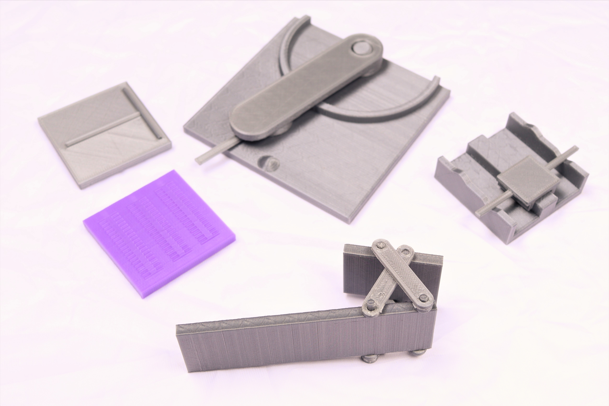
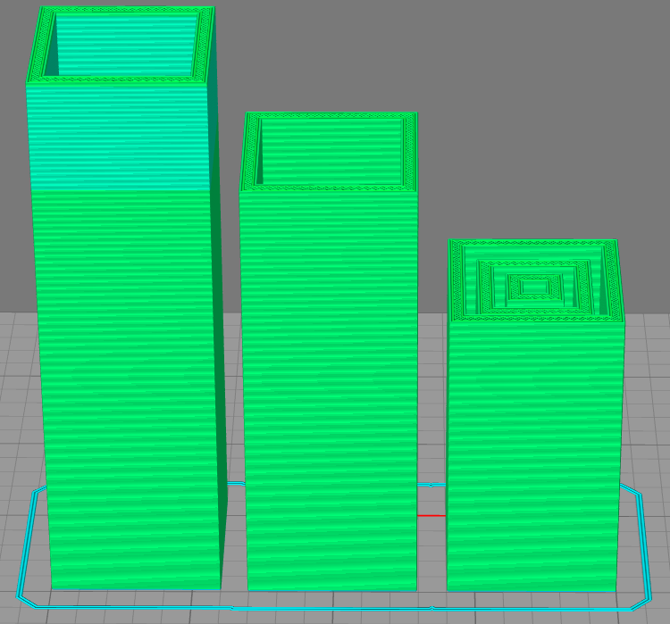
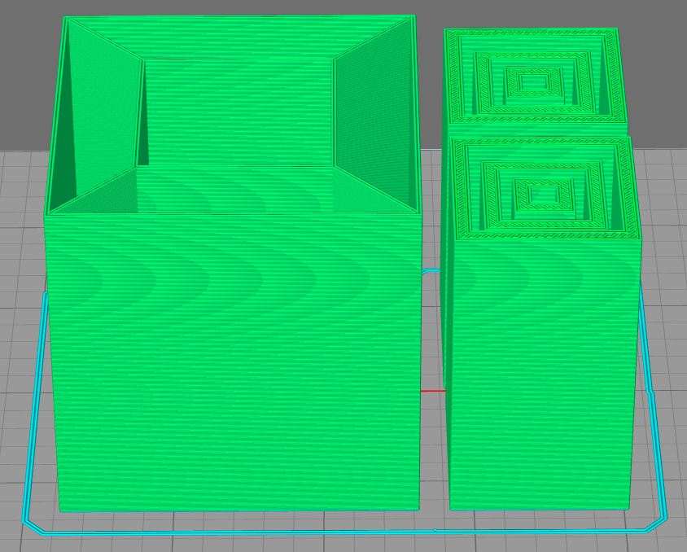
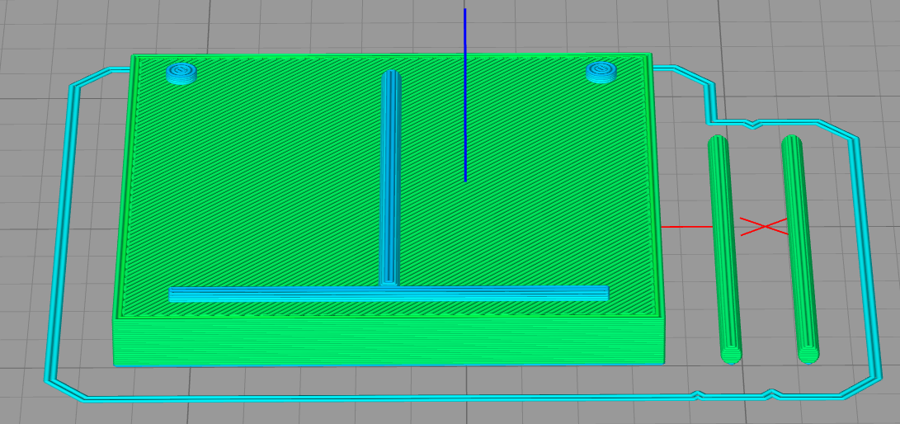
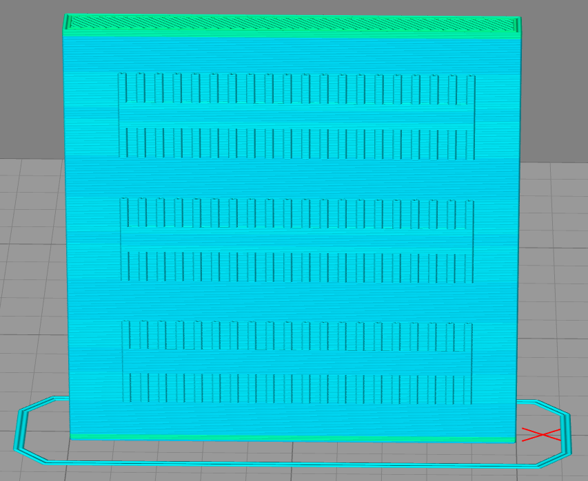
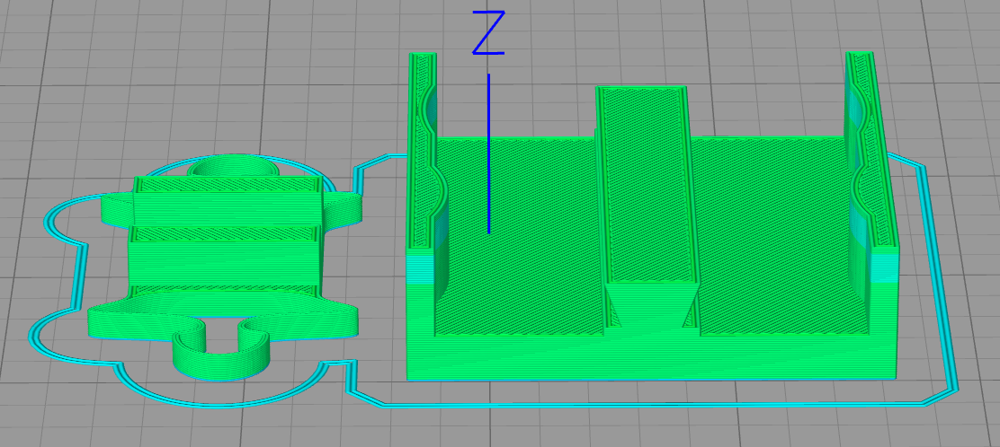
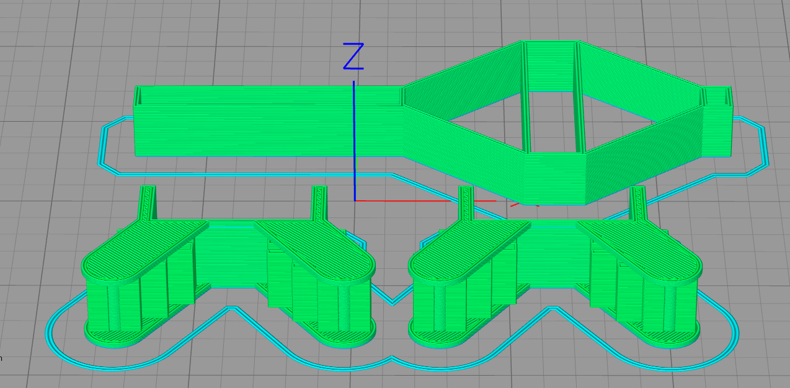

# 3D Printed Haptic Illusions and Demonstrations

Appreciating a sensory illusion often requires you to experience it with your own senses. While this is generally trivial for visual and auditory illusions that can be rendered using commonly available hardware, haptic illusions often require complex mechanical systems.
Vincent Hayward’s, “A brief taxonomy of tactile illusions and demonstrations that can be done in a hardware store” introduced simple and affordable DIY assemblies to make haptic illusions more accessible.
However, we argue that the skills and materials required to fabricate the illusions he describes are often non-trivial, thereby depriving the paper’s intended audience from experiencing and learning about these haptic illusions.
As a novel, more accessible alternative, we propose a series of haptic illusions and demonstrations that can be fabricated using any FDM 3D printer.
Once printed, they can be fully assembled by hand.

In this repository you will find all necessary 3D model files (.stl) and printing guidelines to fabricate your own set of 3D printed illusions and demonstrations.

Antoine Weill-Duflos, Pascal E. Fortin, Jeremy R. Cooperstock 
Shared Reality Lab, McGill University

# 3D printing guidelines

The table below specifics the files necessary to fabricate each illusion, provides a few guidelines on how to print each activity and shows an example of model layout on the 3D printer's print surface.

|Illusion|Files|Printing guidelines|Example FDM printing orientation|
|---|-------|---|---|
| Classic Weight Illusion|1 x sizeillubig.stl 1 x sizeillumedium.stl 1 x sizeillusmall.stl|Make sure you print each file with the exact same slicer settings to ensure that they have approximately the same mass (e.g., layer height, infill %, number of walls, number of top/bottom layers).||
| Impossible Weight Illusion|1 x impossiblebox.stl 2 x impossibleinside.stl|Make sure you print each file with the exact same slicer settings to ensure that they have approximately the same mass (e.g., layer height, infill %, number of walls, number of top/bottom layers).||
| Size Illusion|1 x plate.stl 2 x stick.stl|You may have to print stick.stl files on their side if you are having difficulties getting them to stick on the printing surface.||
| Fishbone Illusion|1 x fishbone.stl|If using a FDM 3D printer, this file should be printed on its side, such that the layers are parallel with the finger travel. The intent is to minimize friction between the finger and the layer lines. Supports should be avoided, but may be needed depending on your 3D printer's performance.||
| Elevation Illusion|1 x elev-base.stl 1 x elev-mobile.stl| The base should be printed flat, such that layers are parallel to the "ground" to reduce friction during motion. The mobile component should be printed on its back to avoid the need for supports and have layers aligned with the base.||
| Elevation Illusion|1 x came.stl 2 x galet.stl|Came.stl should be printed on its side and should not require any support structures. galet.stl should be printed on its side and should be printed with supports.||

# Credit
This work is heavily inspired by "A brief taxonomy of tactile illusions and demonstrations that can be done in a hardware store" by Vincent Hayward. We believe that our efforts are aligned with Hayward's original intent, which was to make tactile illusions and demonstrations more accessible to the general public.

Hayward, V. (2008). A brief taxonomy of tactile illusions and demonstrations that can be done in a hardware store. Brain Research Bulletin, 75(6), 742–752. https://doi.org/10.1016/J.BRAINRESBULL.2008.01.008
